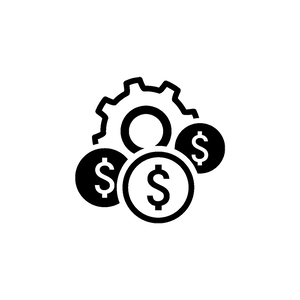
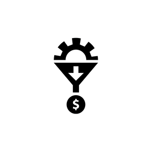

# Name: seo-refactor

[LIVE SITE](https://www.)

## Table of Contents
1.[Description](#description-horiseon-search-engine-optimization)

2.[Usage](#Usage)

3.[Visuals](#visuals)

4.[Authors and Acknowledgement](#authors-and-acknowledgement)

## Description: Horiseon Search Engine Optimization

What I did for the page....  

## Visuals:

## Authors and Acknowledgement